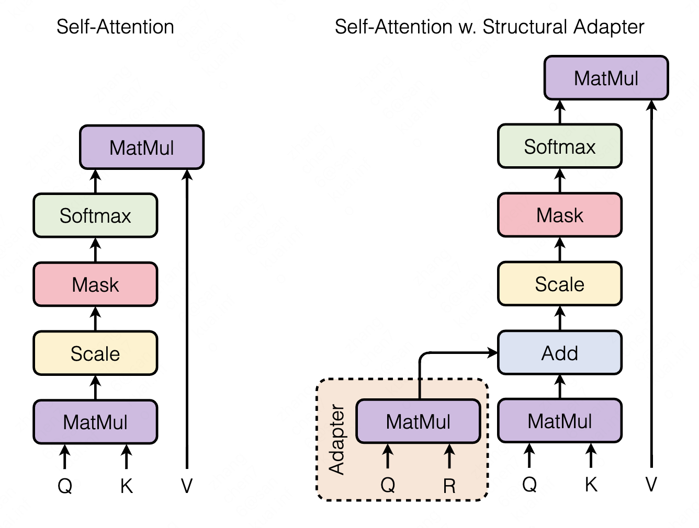
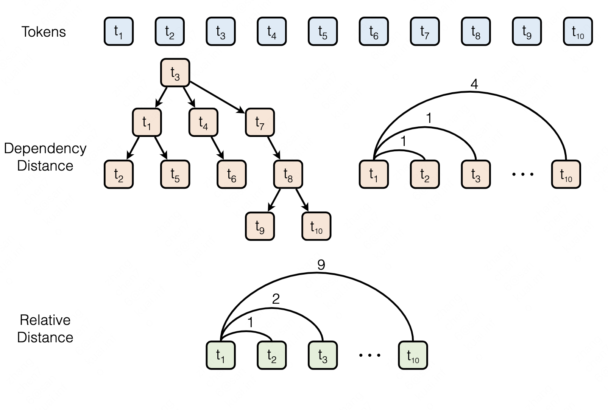

## StructBias

This repository contains code and data for COLING 2022 paper titled [Structural Bias For Aspect Sentiment Triplet Extraction]().

**************************** **Updates** ****************************

<!-- Thanks for your interest in our repo! -->

<!-- Probably you will think this as another *"empty"* repo of a preprint paper 🥱.
Wait a minute! The authors are working day and night 💪, to make the code and models available.
We anticipate the code will be out * **in one week** *. -->

* 9/1/22: We released our code and data. Check it out!

## Quick Links

  - [Overview](#overview)
  - [Getting Started](#getting-started)
    - [Requirements](#requirements)
    - [Training](#training)
    - [Evaluation](#evaluation)
  - [Case Study](#case-study)
  - [Bugs or Questions?](#bugs-or-questions)
  - [Citation](#citation)

## Overview

We propose to address the parameter and latency inefficiencies of incorporating structural bias in language models by using an adapter inplace of the stacked modules and using a cheap-to-compute relative position structure in place of the syntactic dependency structure (MuG with structural adapter).  We release a large-scale ASTE dataset for more confident evaluation for ASTE (Lasted).

 

## Getting Started

### Requirements

- PyTorch
- Numpy

### Training

**Data**

The processed data is placed in `datasets/lasted`.

**Training scripts**

We provide example training scripts for MuG with and without the structural adapter. For example, in `scripts/run_google_bert_train.sh`, we provide an example for training MuG without the adapter. We explain the arguments in following:
* `--mode`: Train or evaluate the model.
* `--pretrained_model_name_or_path`: Pre-trained checkpoints to start with.
* `--embed_learning_rate`: Learning rate for BERT backbones and adapters.
* `--learning_rate`: Learning rate for modules built upon BERT backbones.
* `--hidden_size`: Size of hidden states.
* `--sentiment_size`: Number of types of sentiments.
* `--tag_size`: Number of types of tags
* `--use_adapter`: Use the adapter or not.

**Experiment logs**

For results in the paper, we use Nvidia V100 GPUs with CUDA 11. Using different types of devices or different versions of CUDA/other softwares may lead to slightly different performance. The experiment logs can be found in `experiments` for sanity checks.

### Evaluation

We also provide example training scripts, for example `scripts/run_google_bert_eval.sh`, where arguments share similar meaning as those in training ones.

## Case Study

We present a few cases of recommedation reason extraction from comments, as shown in `cases/rec.txt`.

## Bugs or Questions?

If you have any questions related to the code or the paper, feel free to email Chen (`czhang@bit.edu.cn`). If you encounter any problems when using the code, or want to report a bug, you can open an issue. Please try to specify the problem with details so we can help you better and quicker!

## Citation

Please cite our paper if you use the code or data in your work:

```bibtex
@inproceedings{zhang2022struct,
   title={Structural Bias For Aspect Sentiment Triplet Extraction},
   author={Zhang, Chen and Ren, Lei and Ma, Fang and Wang, Jingang and Wu, Wei and Song, Dawei},
   booktitle={COLING},
   year={2022}
}
```